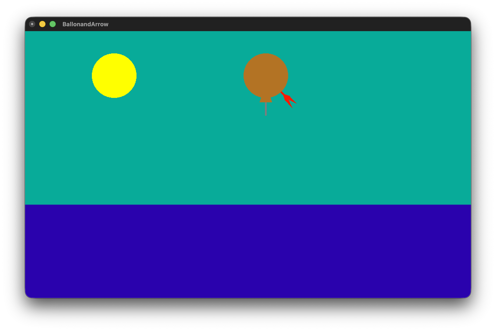
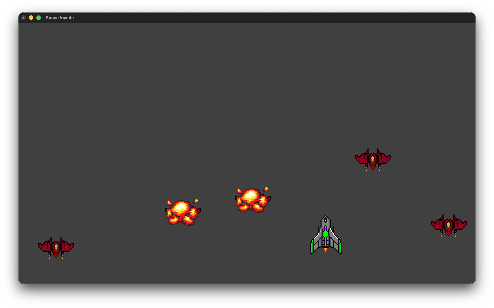
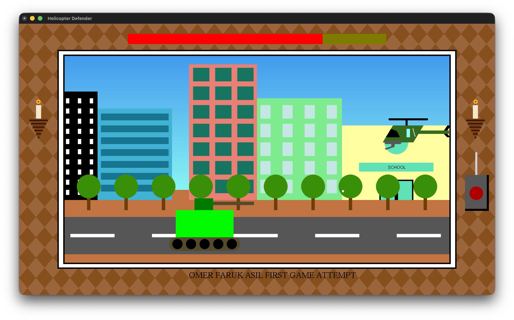

# 🎮 CTIS164 - OpenGL Game Projects

<div align="center">


**Bilkent University CTIS164 - Fundamentals of Programming II**  
*2D OpenGL game projects developed throughout the semester*

</div>

---

## 📋 Table of Contents

- [About](#-about)
- [Games](#-games)
- [Quick Start](#-quick-start)
- [Platform Setup](#-platform-setup)
- [Technical Details](#-technical-details)

---

## 🎯 About

This repository contains 4 interactive 2D games developed as part of **CTIS164 - Fundamentals of Programming II** course. All projects are built using **C++** and **OpenGL/GLUT** library.

✅ **Cross-Platform:** Code is written to run on both Windows and macOS.

---

## 🕹️ Games

### 1️⃣ Arrow & Shadow

<div align="center">

</div>

**Description:** Archery target practice game. Shoot arrows to hit randomly positioned targets.

| Features | Controls |
|----------|----------|
| 🎯 Dynamic target system | `Mouse Click` - Shoot arrow |
| 🌙 Night theme with shadow effects | `ESC` - Exit |
| 🎨 Color reflection effects | |

---

### 2️⃣ Balloon & Arrow

<div align="center">

</div>

**Description:** Pop rising balloons with orbiting arrows. The arrow follows an orbital trajectory.

| Features | Controls |
|----------|----------|
| 🎈 Colorful balloon system | `Mouse Click` - Change color |
| 🔄 Orbital arrow movement | `ESC` - Exit |
| 📈 Score system | |

---

### 3️⃣ Space Invade

<div align="center">

</div>

**Description:** Classic Space Invaders style arcade shooter. Defend against waves of alien invaders!

| Features | Controls |
|----------|----------|
| 👾 Enemy alien waves | `← →` - Move |
| 🚀 Player spaceship | `Space` - Fire |
| 💥 Explosion effects | `ESC` - Exit |

---

### 4️⃣ Tank vs Helicopter

<div align="center">

</div>

**Description:** Ground vs air combat game. Take down the helicopter before time runs out!

| Features | Controls |
|----------|----------|
| 🚁 Animated helicopter | `← → ↑ ↓` - Move |
| ⏱️ Countdown timer | `R` - Restart |
| 💣 Explosion effects | `ESC` - Exit |

---

## 🚀 Quick Start

### macOS
```bash
# 1. Install GLUT (required)
brew install freeglut

# 2. Clone the project
git clone https://github.com/YOUR_USERNAME/OPENGL_Projects.git
cd OPENGL_Projects

# 3. Build and run
make all
./arrow_shadow      # or: make run1
./ballon_arrow      # or: make run2
./space_invade      # or: make run3
./tank_helicopter   # or: make run4
```

### Windows
```cmd
# 1. Install Visual Studio 2019/2022
# 2. Download FreeGLUT: https://freeglut.sourceforge.net/

# 3. Clone the project
git clone https://github.com/YOUR_USERNAME/OPENGL_Projects.git

# 4. Open any .sln file in project folders
# 5. Build > Build Solution (Ctrl+Shift+B)
# 6. Debug > Start Without Debugging (Ctrl+F5)
```

---

## 🔧 Platform Setup

### macOS Setup (Detailed)

1. **Install Homebrew** (if not installed):
   ```bash
   /bin/bash -c "$(curl -fsSL https://raw.githubusercontent.com/Homebrew/install/HEAD/install.sh)"
   ```

2. **Install FreeGLUT:**
   ```bash
   brew install freeglut
   ```

3. **Build:**
   ```bash
   make all
   ```

### Windows Setup (Detailed)

1. **Install Visual Studio:**
   - Download [Visual Studio Community](https://visualstudio.microsoft.com/downloads/)
   - Select "Desktop development with C++" workload

2. **Install FreeGLUT library:**
   - Download [FreeGLUT](https://www.transmissionzero.co.uk/software/freeglut-devel/)
   - Copy `freeglut\bin\x64\freeglut.dll` → `C:\Windows\System32\`
   - Copy `freeglut\lib\x64\freeglut.lib` → Visual Studio lib folder
   - Copy `freeglut\include\GL\*` → Visual Studio include folder

3. **Build the project:**
   - Open `.sln` file
   - Right-click solution → "Build Solution"

---

## 🔧 Technical Details

| Property | Value |
|----------|-------|
| **Language** | C++ 11 |
| **Graphics API** | OpenGL 2.1 + GLUT |
| **Timer** | 16-17ms (≈60 FPS) |
| **Window Size** | 1400x800 / 1000x600 |

### Cross-Platform Compatibility

The code uses preprocessor directives to work on both Windows and macOS:

```cpp
#ifdef __APPLE__
    #include <GLUT/glut.h>  // macOS
#else
    #include <GL/glut.h>    // Windows/Linux
#endif
```

### Techniques Used

- **2D Graphics:** `glBegin/glEnd`, `glVertex2f`, `glColor3f`
- **Animation:** GLUT timer callback system
- **User Input:** Keyboard & Mouse callback functions
- **Math:** Trigonometric functions (sin, cos) for movement
- **Collision Detection:** Bounding box / Distance-based collision

---

## 📁 Project Structure

```
OPENGL_Projects/
├── Arrow&Shadow/
│   ├── Source.cpp          # Main source code
│   └── vec.h               # Vector helper library
├── Ballon&Arrow/
│   ├── Source.cpp
│   └── vec.h
├── SpaceInvade/
│   └── Source.cpp
├── TankvsHelicopter/
│   └── Source.cpp
├── screenshots/            # Game screenshots
├── Makefile               # Build script for macOS/Linux
├── .gitignore
└── README.md
```

---

## 👨‍💻 Developer

**Ömer Faruk Asıl**  
Bilkent University - CTIS164

---

## 📄 License

This project was developed for educational purposes. Please use in accordance with academic integrity policies.

---

<div align="center">

**⭐ If you like it, don't forget to give it a star! ⭐**

</div>
